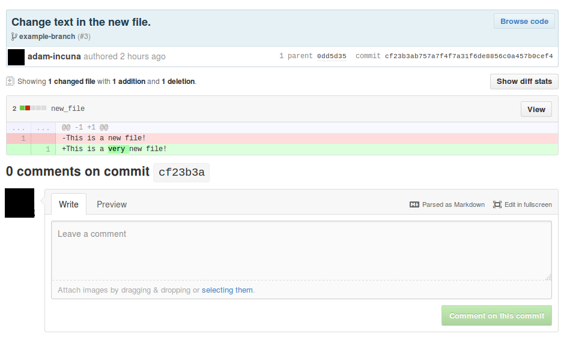
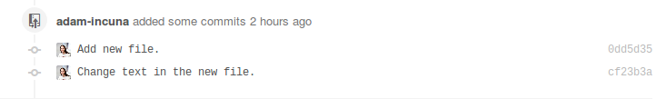
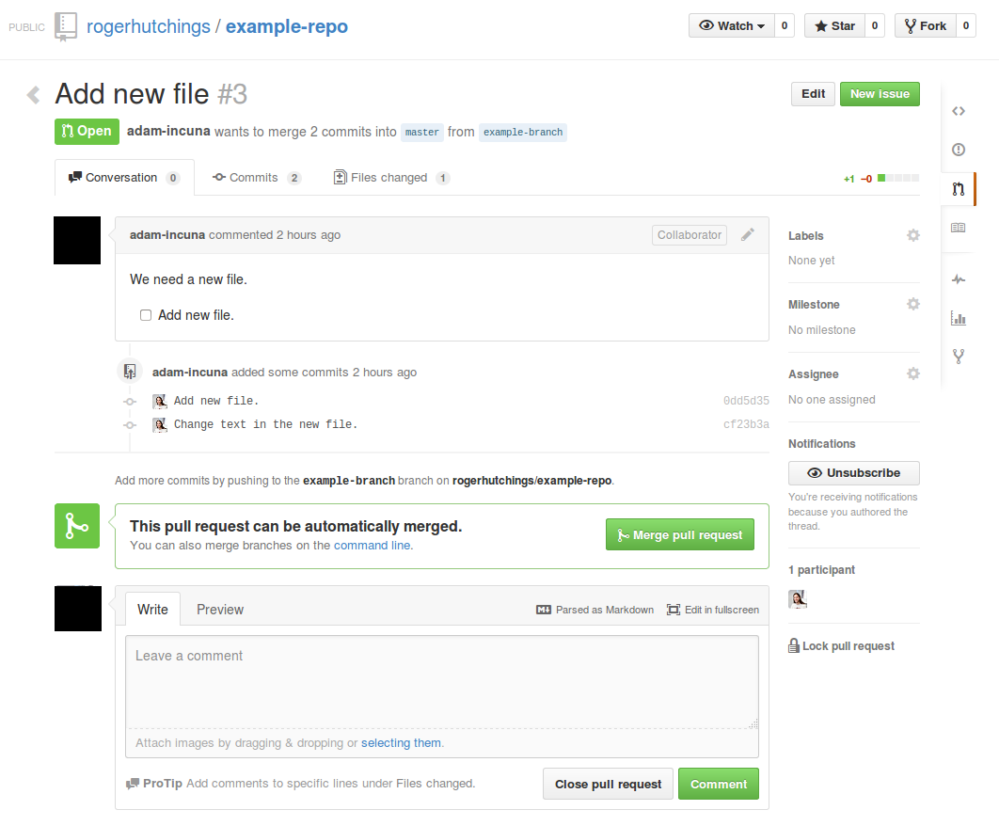

# Version Control

Version control is an invaluable piece of technology used by software developers worldwide. It allows development teams to coordinate their efforts, divide up work, review one another's code, undo mistakes, run experiments, and view every change that's ever been made to the code. Working as a team on almost any project without a version control system would be very difficult, and even when working alone, version control provides insurance against mistakes (of any size) or computer crashes.

GitHub is a web interface to the Git version control system. Git was initially built in 2005 by Linus Torvalds, and is a complex, very capable system. Git itself is mostly used through the command-line terminal, but GitHub allows developers and account managers alike to view the code, create and discuss issues, and manage versions.

This section is a quick overview of how Git works, and how those features show up on the GitHub site.

## Why use version control?

A team (of developers and one or more account managers) working together on a project has a few challenges to address before we can get anywhere.
- How do we divide up and assign work?
- How do the developers keep each other's code up to date?
- What happens if two developers change the code at the same time?  (This happens constantly.)
- How do you, as the account manager, understand and keep track of what's going on?
- How do developers review each other's code, for quality and style consistency?

Git and GitHub solve all of these problems.

Git itself allows a definitive version of the code to be kept in a secure remote location. Developers can download this code, modify it, and then submit their changes to Git for review. These changes show up on GitHub for everyone else on the team to look at; the code can be reviewed, changed as necessary, and then eventually combined into the definitive version. Developers can then update the code on their computers from Git whenever they want to. This neatly addresses all the problems with keeping up to date and working on the code simultaneously; any number of people can submit concurrent changes to Git, and even if those changes clash, the conflicts can be automatically or manually resolved.

You as an account manager can view the changes on GitHub as they come in, and use the website to open *issues* for the developers to address. An issue represents a piece of work - adding a small feature, fixing a bug, making a change requested by the client. Developers can then link submitted changes to an issue, making it easier for them and you to track what's being done to fix it.

Without version control, coordinating the team's efforts would become very difficult. GitHub goes above and beyond the typical advantages of a version control system by allowing for discussion and streamlined division of work. It's all upside.

## Repositories

Code is stored in *repositories*, each of which houses everything needed for a self-contained project. A repository contains the main version of the project code (usually referred to as *master*), any number of alternate versions being worked on (called *branches*), and lots of historical information. It will have a page on GitHub; from that page, you can view and download the code, submit issues, manage people assigned to the project, and more.

Because each repository represents a single project, an individual developer will rarely need to work on multiple repositories together; typically, one repository contains everything for, say, a particular site's front-end or a complete back-end API (which may or may not be used by multiple sites).

## Commits

Having a repository of code isn't much use if it can't be modified, so version control systems have a mechanism for submitting changes, called *commits*. The word 'commit' is used both as a verb and a noun.

A commit is a set of changes to files that's meant to represent an "atomic" change to the project - that is, the minimum amount of modification necessary to introduce or fix functionality without causing errors or making tests fail. In practice, commits don't always follow this definition exactly, but they're small, and from the perspective of Git and GitHub, are essentially the minimum unit of work. (An issue will require one or more commits to resolve, for instance.)

Each commit has a short message summarising the changes it makes in a quickly-readable way. It also has a page to itself on GitHub, showing the changes it makes to the files in the project, which looks like this:

The lines highlighted in red are being removed, and those highlighted in green are being added. Normally, a commit is submitted separate from the master version of the code, and won't be applied to the master version until it's been reviewed by other developers. (Despite the name, a commit isn't considered to be particularly binding until it's been deemed correct, and developers make commits freely.)

Commits will show up in issues that they're linked to:

You can see that the commits are listed separately from each other, and come in a particular order. Reading the list of commits and their descriptions allows you to keep up with changes to the code as they're made, and track progress on an issue.

## Master and branches

We've touched on the idea of *master* and *branches* already, but they deserve proper explanation.

The central, definitive version of the code in a repository is called *`master`*. It is sacred, and must not be sullied; anything committed to `master` must be done so only with care and the approval of other developers. Git allows developers a lot of flexibility in making changes, experimenting, and fixing mistakes, so to compensate for the chaos that can bring, `master` is kept as clean and consistent as possible. When a developer downloads code for working on, he or she downloads it from `master`; when we deploy a product, we do it with the code in `master`.

For individual work, developers will make *branches*. Branches are so-called because they look like the branches of a tree; a branch is created from a certain point in the history of `master` (or another branch), and diverges from there.

For instance, let's say we have a developer called Alice. Alice needs to fix a bug where a certain button doesn't display properly. She creates a branch, calls it `fix-the-broken-button`, sets her computer to work on that branch, and starts programming. Any commits she makes will go to that branch, leaving the holy `master` untouched by unreviewed changes.

At the same time as Alice starts working on the broken button, Bob is assigned to add some new text and graphics to the header of the page the button is on. He creates a branch, calls it `improve-page-header`, sets his computer to work on that branch, and starts programming.  Any commits he makes will go to that branch, separate from both `master` and Alice's work. The two developers can code entirely independently, even if they're working on the same page.

Later, when Alice and Bob have completed their respective labours, they can turn their branches into...

## Pull requests

A *pull request* is a group of commits, on a branch, that are intended to be reviewed and combined into `master`. Pull requests are usually either made from or linked to issues; GitHub, at time of writing, has a functionality that allows a developer to combine a branch and an issue into a full pull request, displaying both the issue discussion and the commits made to address it in one place.

Here's an example of a pull request:

Here, the code can be seen and reviewed by everyone. Typically, by this stage, your role in management and providing information is complete; comments will largely come from other developers, suggesting improvements to the code. The developer who submitted the pull request can continue to make commits to the branch the pull request is built on, and GitHub will update to display these changes on the pull request page. Once everyone is happy, one of the developers will *merge* the changes into `master`, and the pull request is closed and archived.

## Merging

There's not much point to branching if the changes made to a branch can't be combined back into the main code at some point later, and this combination process is called *merging*. All of the commits performed to a branch since it diverged from its parent (normally `master`) are applied to that parent, in order.

The new commits are merged in on top of any other commits that have been applied to the parent since the branch was split off. This often happens, because multiple developers will be working on a project at the same time. Occasionally, two developers will make changes to the same file which happen to clash with one another; when one edit is merged on top of the other, someone will have to resolve the conflict manually.

When Alice - one of our example developers from earlier - finishes her work, once the pull request has been reviewed, someone will hit the giant `Merge pull request` button. When this happens, Git takes all of the commits on Alice's `fix-the-broken-button` branch, and applies them to `master`. The same thing will happen when Bob's pull request is merged. Even if Alice's code has been merged first, Git will still allow Bob to merge his code too. If the two clash, GitHub will grey out the `Merge pull request` button, and Bob will have to manually take the commits from `master` and apply them to his branch, fixing any conflicts along the way. The merge button then reactivates and Bob's code is applied.

## Wrapping up

Using version control, any number of developers can work on the same project at the same time, usually painlessly. Any changes that a developer wants to submit to `master` will be displayed as a pull request on GitHub before being merged into the core code, allowing space for review, and giving you an opportunity to track the team's progress. Issues can be opened and discussed to request bug fixes or new functionality, and developers can allocate their work based around those, meaning the team has good direction and a useful feedback mechanism for everybody. Magic!
